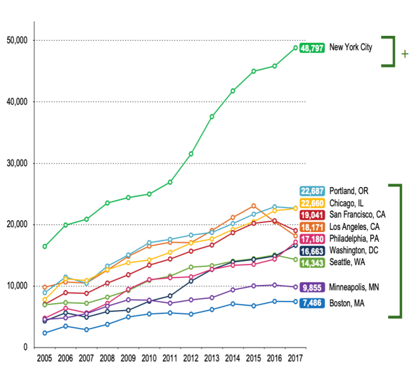

# Evaluation-of-Vision-Zero-Plan

**KEYWORDS**  
GIS, mapping, spatial analysis, death and injury rate, regression model, time series analysis 

**PROBLEM**  
Evaluate NYC Vision Zero Plan https://www1.nyc.gov/content/visionzero/pages/ 
 
**TECHNIQUES** 
Python(data cleaning and exploratory analysis), time series analysis, spatial analysis, Tableau 

**SOLUTIONS** 
Calculate decrease in number of death and injury; identify seasonal trend; focus on three initiatives for improvement

**DATA SOURCE** 
NYC OPEN DATA https://data.cityofnewyork.us/browse?tags=vzv  

#

Cycling to work in NYC has grown **TWICE faster** as other major cities between 2012 and 2017. On a typical day, there are about 490,000 cycling trips made in New York City. Nearly one quarter of adult New Yorkers ride a bike, which are nearly 1.6 million people. Because of the high demand of cycling trends in nyc, **vision zero plan was created by New York City Mayor Bill de Blasio in 2014. Its purpose is to eliminate fatalities and serious injuries on New York City streets by 2024.**

Vision Zero in New York City is based on a similar program of the same name that was implemented in Sweden. The original Swedish theory hypothesizes that pedestrian deaths are not as much "accidents" as they are a failure of street design. The deaths in New York City have been decreasing from implementation of the plan through 2018, however, **traffic injuries and crashes have been increasing**. Therefore, it is important for us to **examine the effectiveness of Vision Zero**. 
 
Out of 206 initiatives, three initiatives that are most relevant to cyclists are picked 
 
- Speed Humps  
- Arterial Slow Zone 
- Bike Priority Area 
 
###### Speed Humps: a raised area of roadway designed to reduce vehicle speed 
###### Arterial Slow Zone: a combination of a lower speed limit, signal timing changes, distinctive signs and increased enforcement 
###### Bike Priority Areas: neighborhoods with high numbers of cyclist KSI(Killed or Seriously Injured) and few dedicated bike facilities 

  

  

  
  

