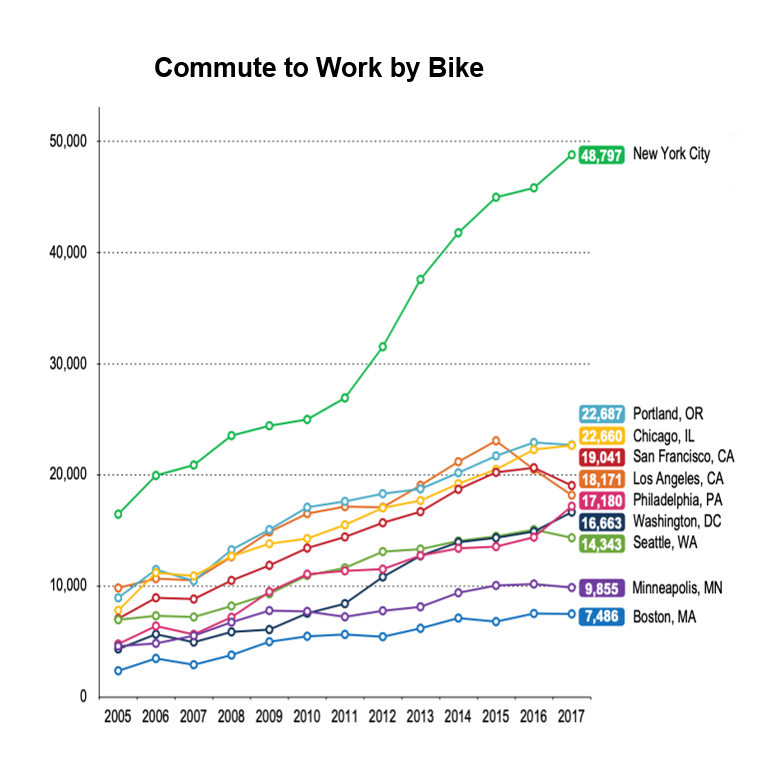
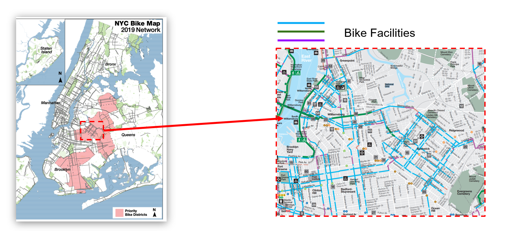

# Evaluation-of-Vision-Zero-Plan

**KEYWORDS**  
GIS, mapping, spatial analysis, death and injury rate, regression model, time series analysis 

**PROBLEM**  
Evaluate NYC Vision Zero Plan https://www1.nyc.gov/content/visionzero/pages/ 
 
**TECHNIQUES** 
Python(data cleaning and exploratory analysis), time series analysis, spatial analysis, Tableau 

**SOLUTIONS** 
Calculate decrease in number of death and injury; identify seasonal trend; focus on three initiatives for improvement

**DATA SOURCE** 
NYC OPEN DATA https://data.cityofnewyork.us/browse?tags=vzv  

## Background 
Cycling to work in NYC has grown **TWICE faster** as other major cities between 2012 and 2017. On a typical day, there are about 490,000 cycling trips made in New York City. Nearly one quarter of adult New Yorkers ride a bike, which are nearly 1.6 million people. Because of the high demand of cycling trends in nyc, **vision zero plan was created by New York City Mayor Bill de Blasio in 2014. Its purpose is to eliminate fatalities and serious injuries on New York City streets by 2024.**

Vision Zero in New York City is based on a similar program of the same name that was implemented in Sweden. The original Swedish theory hypothesizes that pedestrian deaths are not as much "accidents" as they are a failure of street design. The deaths in New York City have been decreasing from implementation of the plan through 2018, however, **traffic injuries and crashes have been increasing**. Therefore, it is important for us to **examine the effectiveness of Vision Zero**. 
 
Out of 206 initiatives, three initiatives that are most relevant to cyclists are picked 
 
- Speed Humps  
- Arterial Slow Zone 
- Bike Priority Area 
 

###### Speed Humps: a raised area of roadway designed to reduce vehicle speed 
###### Arterial Slow Zone: a combination of a lower speed limit, signal timing changes, distinctive signs and increased enforcement 
###### Bike Priority Areas: neighborhoods with high numbers of cyclist KSI(Killed or Seriously Injured) and few dedicated bike facilities 
 

## Research Questions 
Q1: Do the current 10 priority bicycle districts best represent the areas that need ridership safety attention? 
Q2: What is the impact of Speed Hump Policy on bicycle fatalities and injuries? 
Q3: What is the probability that a cyclist gets killed or injured with different initiatives implemented? 

## Time Series Analysis 

  
  

 
Observations = Trend + Seasonality + Residual

**Trend** 
There was a huge increase of cyclists getting injured from 2015 to 2016, which may seem like the roads have become more dangerous. However, it is not true. It is because the total cyclists population has increased significantly during that period of time because of 2 reasons. 
1) NYPD started to use an electronic reporting system, which allows NYPD to record more data than before. 
2) introduction of bike sharing system (Citi Bike) had encouraged more people cycling, and therefore leading to more injury and dead cases.  

Due to data quality concern, we decide to remove 2015 to 2016 data and focus on analysis between 2013 versus 2014 and 2017 versus 2018

**Seasonality** 

The majority of cyclist injuries and fatalities occurred from March to September of each year 

## Spatial Analysis 
**Change of the number of cyclist killed or injured by zipcode** 
 

  

1) most of the places are becoming safer especially Midtown Manhattan 
2) Number of cyclist injured or killed increased in Bronx and Staten Island 

Further investigation of the regions that are fairly safe and unsafe needs to be conducted, will we take midtown Manhattan and Bronx as an example. 

**Implementation of the initiaive in midtown Manhattan and Bronx** 
|                     | Midtown Manhattan | Bronx |
| ------------------- | ----------------- | ----- |
| Speed Hump          | 1700              |6370   |
| Arterial Slow Zone  | 7427              |4078   |
| Signal Timing       | 33067             |9818   |
| Left Turn Traffic Calming| 8094         |227    |

Midtown Manhattan **outnumbered** Bronx in many other initiatives 
Bronx has more speedhump, but it is becoming more dangerous 

## Logistics Regression 

Observations: among all collision events, only collision events near or within 7 initiatives regions are considered (i.e. arterial, bike, cross, slow, left, signal, speed_hump) 
Features: time (i.e. year, month, day_of_week, and hour) and whether an event is before/after initiatives (-> False/True)  
Output: whether the number of cyclists injured or killed is zero or nonzero (-> False/True) 

Results: 
1) the probability output of the logistic regression can be interpreted as a conditional probability - given a collision event, how likely the event involves cyclist injured or killed (i.e. non-zero number of cyclists injured or killed). 
2) statistically significant (negative): Arterial_Slow_Zones 
3) statistically significant (positive): Neighborhood_Slow_Zones, Signal_Timing 
4) statistically insignificant: Bike_Priority_Districts, Enhanced_Crossings, Left_Turn_Traffic_Calming, Speed_Humps 

Conclusion: Suppose that a collision event occurs, **Arterial_Slow_Zones** reduce the chance of a cyclist injured or killed in an car accident. 

## Evaluation of Bike Priority Districts 
**What districts will be prioritized?** 
Department of Transportation picked the ten prioritized districts accroding to KSI and bike facilities coverage. Regions with high KSI and low bike facilities coverage rate are given priority when there is plan to build more bike facilities. 
 
**Did this initiative work?** 
**Yes.** 
From 2017 to 2018, the number of cyclist killed or injured in the ten bike priority districts decreased by 4.6%  which slightly higher than the rest of places.
We can say that the bike priority district is making the places safer. 
 
**Are there any issues?** 
**Yes.** 
When we checked the bike map of 2019 provided by department of transportation we found the many prioritized bike districts now have launched plenty of bike facilities. For example in this map, you can see Williamsburg area (marked in red) is covered with all kinds of bike facilities. Such area was needing special attention, but is fine today. However, this information needs to be updated in order to better allocate resouces.  

  

**How can we improve this initiative?**
**Cyclist Safety Map - We need to take care of dangerous places using up-to-date data** 
Cyclist safety map is created using the total number of cyclists injured and killed. Lower east side of Manhattan and Williamsburg area are pretty dangerous. It raised a question that even if there are many facilities designed to protect the bike riders, why the KSI is still so high. Of course the cause can be complicated, but it reminds us that further research is needed in those regions. **Are these bike facilities really helping reduce the fatality and injury rate of the cyclists or unfortunatelly working the opposite way?** In the future, when we build more bike facilities, we want all the bike facilities that we build to reduce the KSI, insteading of working the other way around. 

  

## Conclusions and Recommendations
**Conclusions**
1) There is a seasonality trend in cyclist injuries and fatalities, which is that more incidents happen from March to September. 
2) The Speed Hump Policy is effective in decreasing cyclists’ fatality and injury rate. 
3) The Arterial Slow Zones initiative is effective in decreasing cyclists’ fatality and injury rate. 
4) Based on our Cycling Risk Score, the current 10 priority bicycle districts do not best represent the areas that need ridership safety attention 
**Recommendations**
1) Install facilities before March to ensure the running of facilities during March to September and increase the number of educational programs during that time period. 
2) Add more speed humps on A,B,C,D,E, regions where Cycling Risk Score is high.  
3) Invest more budget on the The Arterial Slow Zones initiative.  
4) Exclude areas that have been taken care of, and add more that needs attention  

